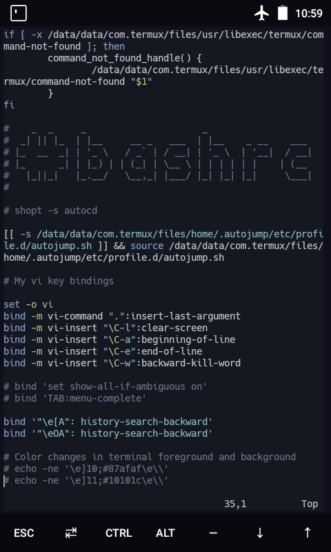
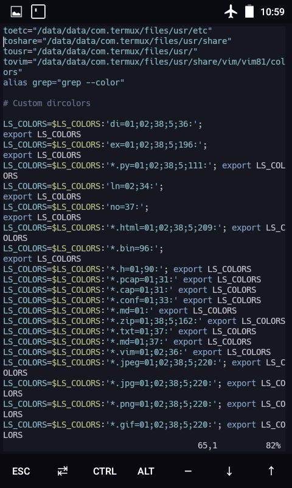
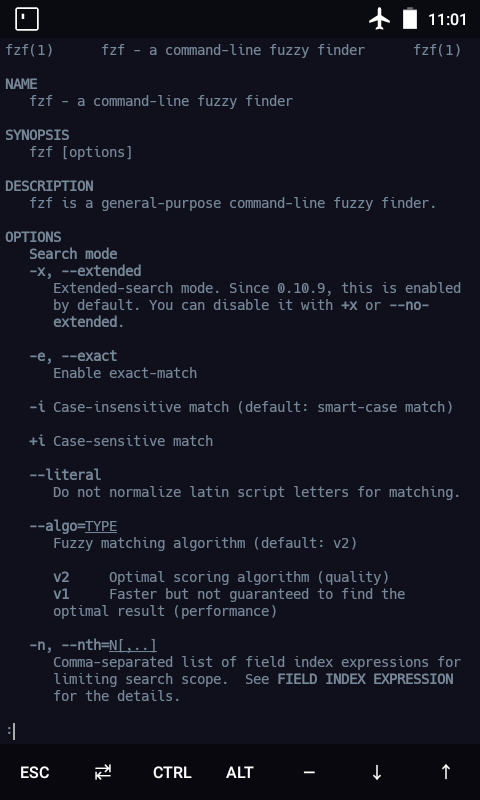
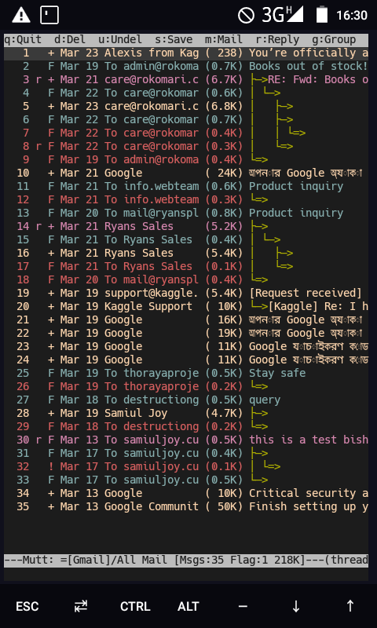
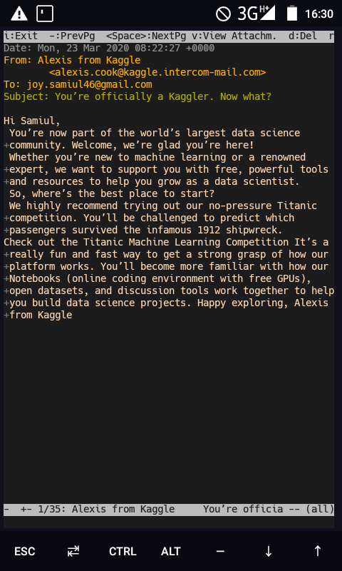
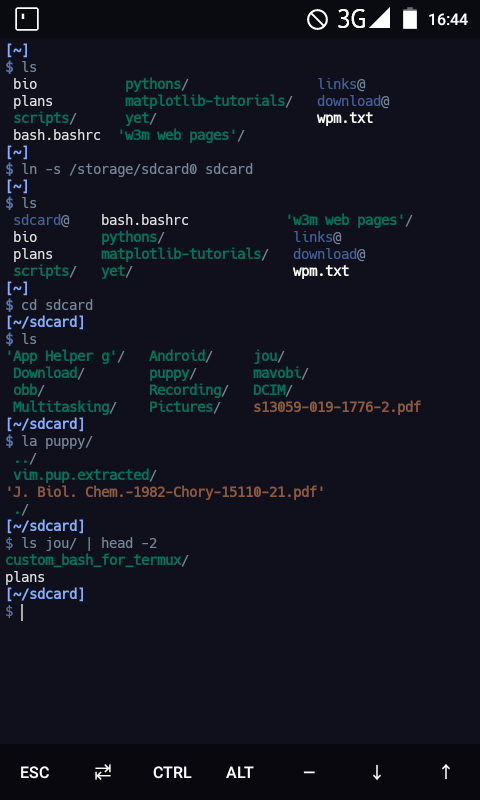
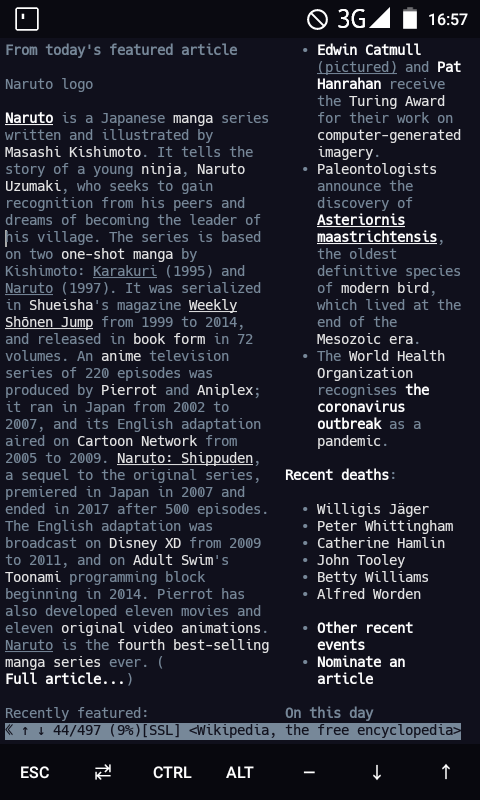

# A bit of cutomization for the termux Bourne Again Shell(BASH), and some easy binaries.sh

## bash.bashrc 
This here is a little modification to the bash.bashrc file in the /usr/etc/bash.bashrc. Enjoy tweaking with these c:
Replace or copy the contents to your usr/etc/bash.bashrc.

## bash.bashrc2 (Inspired by gruvbox colorscheme)
This bash.bashrc2 is what my bash.bashrc looks like. It's inspired by gruvbox.vim theme from vim editor.Added couple of modifications like changing the default cursor to I-beam and tons of aliases. This theme was inspired by gruvbox theme from vim

## bash.bashrc3(Night Owl theme)
Yet another update, custom prompts and perhaps a solarized version of my own, Inspired by iceberg.vim and camo.vim theme from vim. I actually made a combination of these 2 colorschemes in my dotfiles/.vimrc and came up with a new colorscheme, and I actually quite like it to be honest.

## binaries.sh
These simple shell scripts might just make working a lot easier.
Copy these to usr/bin and dont forget to chmod u+x

## Color chart 
Also, I've added a 256 color chart to help you better understand what I'm doing here. You can match the color codes with the bash.bashrc files

## Vim Plugins
My vim plugins are included in the /dotfiles directory

## dotfiles
The dotfiles contain some config files for my tmux, vim and some key bindings(for vim) I'm using for my bash atm.

  ## Here's a screenshot to "bash.bashrc" config for termux looks like

   

  ## Here's some screenshots to my gruvbox-theme termux terminal

   
   
   
   
   

  ## Night-owl theme

   
   
   
   
 ## This is what my terminal looks like as of 23rd March, 2020, 17:30
	
   My bashrc
  
  
  
  

   mutt email
  
  mutt email
  
   terminal home
  
   w3m wikipedia
  

 ## I am using mutt as my email client and w3m as a terminal browser
## If you like what you see, feel free to support me!, you can email me at joy.samiul46@gmail.com
