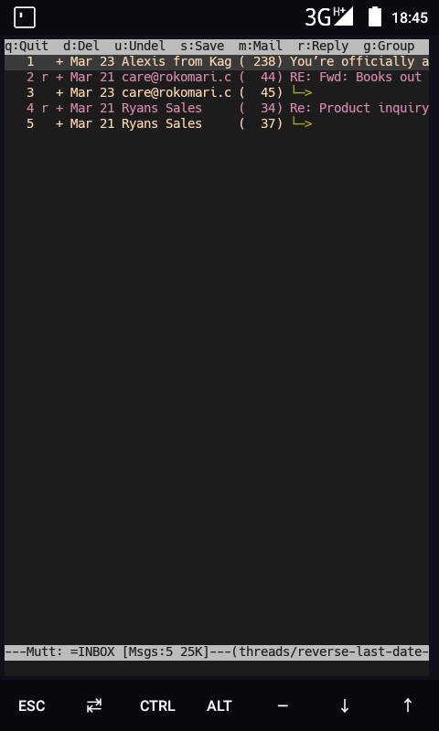
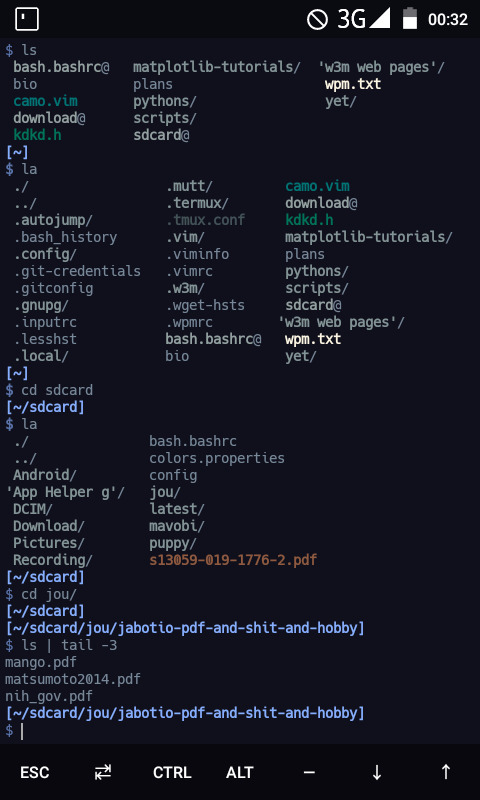
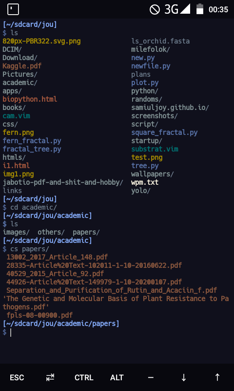

<html>
<h1>A bit of cutomization for the termux Bourne Again Shell(BASH), and some easy binaries.sh</h1>

<h2>bash.bashrc</h2>

This here is a little modification to the bash.bashrc file in the /usr/etc/bash.bashrc. Enjoy tweaking with these c:
Replace or copy the contents to your usr/etc/bash.bashrc.

<h2>bash.bashrc2 (Inspired by gruvbox colorscheme)</h2>

This bash.bashrc2 is what my bash.bashrc looks like. It's inspired by gruvbox.vim theme from vim editor.Added couple of modifications like changing the default cursor to I-beam and tons of aliases. This theme was inspired by gruvbox theme from vim

<h2>bash.bashrc3(Night Owl colorscheme)</h2>

Yet another update, custom prompts and perhaps a solarized version of my own, Inspired by iceberg.vim and camo.vim theme from vim. I actually made a combination of these 2 colorschemes in my dotfiles/.vimrc and came up with a new colorscheme, and I actually quite like it to be honest.

<h2>bash-scripts</h2>

These simple shell scripts might just make working a lot easier.
Copy these to usr/bin and dont forget to chmod u+x

<h2>.inputrc</h2>

The .inputrc dotfile contains the vi key-bindings for the shell..just copy and paste it to your home(~/) and probably type in termux-reload-settings.

<h2>Color chart</h2>

Also, I've added a 256 color chart to help you better understand what I'm doing here. You can match the color codes with the bash.bashrc files

<h2>Vim Plugins</h2>

My vim plugins are included in the /dotfiles directory

<h2>dotfiles</h2>

The dotfiles contain some config files for my tmux, vim and some key bindings(for vim) I'm using for my bash atm.

<h2>Here's a screenshot to "bash.bashrc" config for termux</h2>
</img>
<h2>Here's some screenshots to my gruvbox-theme inspired termux terminal</h2>
     
    

  ## Night-owl theme

     
   
 ## This is what my terminal looks like as of 23rd March, 2020, 17:30
	
   My bashrc  

   mutt email mutt email
  
   terminal home  w3m wikipedia
## I am using mutt as my email client and w3m as a terminal browser  

## This has been my chronological improvisation of termux colorschemes lol!
## This is inspired by solarized colorscheme of the gnome-terminal
The bash.bashrc for this is located in the dotfiles/bash.bashrc and the colors.properties in dotfiles/.termux/colors.properties. Enjoy tweaking with these
## some screenshots     

  
  
  

## If you like what you see, feel free to support me! Enjoy!
